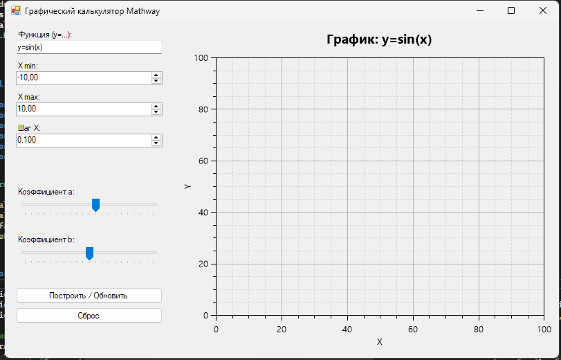

# GraphingCalculator

Графический калькулятор — это проект для построения графиков математических функций, вычислений и визуализации данных. Этот репозиторий содержит исходный код, инструкции по запуску и примеры использования.

## Возможности


- Построение графиков различных математических функций
- Поддержка нескольких видов графиков (линейные, параболы, тригонометрические и др.)
- Масштабирование и перемещение области графика
- Ввод пользовательских формул
- Экспорт графиков в изображения (если реализовано)
- Удобный и интуитивно понятный интерфейс

## Установка

1. Клонируйте репозиторий:
   ```bash
   git clone https://github.com/ReNothingg/GraphingCalculator.git
   ```
2. Перейдите в папку проекта:
   ```bash
   cd GraphingCalculator
   ```
3. Следуйте инструкциям по установке зависимостей и запуску (см. раздел "Запуск").

## Запуск

_Укажите здесь инструкции по запуску приложения. Например:_

- Для Python:
  ```bash
  pip install -r requirements.txt
  python main.py
  ```
- Для других языков опишите соответствующие команды.

## Использование

1. Запустите приложение.
2. Введите математическую функцию в соответствующее поле (например, `y = sin(x)`).
3. Нажмите кнопку "Построить график".
4. Используйте инструменты масштабирования и перемещения для более детального просмотра.

## Примеры формул

- Линейная: `y = 2x + 3`
- Квадратичная: `y = x^2 - 4x + 2`
- Синусоида: `y = sin(x)`
- Экспонента: `y = e^x`

## Вклад

Будем рады вашим предложениям и pull-request'ам! Для этого:

1. Форкните репозиторий.
2. Создайте новую ветку: `git checkout -b feature/your-feature`
3. Внесите изменения и сделайте commit: `git commit -am 'Add new feature'`
4. Отправьте ветку: `git push origin feature/your-feature`
5. Откройте pull-request.

## Лицензия

Лицензия MIT.

## Контакты

- Автор: [ReNothingg](https://github.com/ReNothingg)
- Вопросы и предложения: создавайте issue или пишите в обсуждениях репозитория.